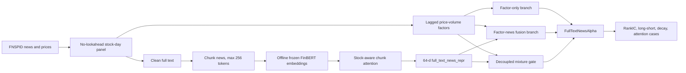

# News-Alpha-Z

News-Alpha-Z is a GitHub-ready research scaffold for building one interpretable full-text financial news factor:
`FullTextNewsAlpha`.

The project is a quant research pipeline, not a trading bot, GraphRAG system, multi-agent stock picker, or end-to-end
large-model training project. It upgrades headline-level news representations into stock-day full-text chunk
representations, then plugs that representation into a RAM-style factor/news mixture with decoupled gate training.

## Project Motivation

Most lightweight news alpha demos encode only titles or headlines. That is convenient, but it discards context that often
matters in financial news: guidance language, acquisition terms, risk disclosures, regulatory updates, and management
commentary buried deep in the article. Encoding full articles as one long sequence is also wrong for BERT-style encoders:
it breaks length limits and wastes memory.

This project uses a safer design:

- clean full-text news bodies;
- split each article into independent encoder-sized chunks;
- encode chunks offline with frozen FinBERT or DeBERTa;
- pool chunks with stock-aware attention;
- construct one gated incremental news factor over a factor-only baseline.

## Method Overview

Method anchors:

- [Exploring the Synergy of Quantitative Factors and Newsflow Representations](https://arxiv.org/abs/2510.15691):
  factor-only branch, factor-news fusion branch, mixture gate, and decoupled training.
- [FNSPID](https://arxiv.org/abs/2402.06698) and
  [FNSPID GitHub](https://github.com/Zdong104/FNSPID_Financial_News_Dataset):
  free financial news and stock price source.
- [ProsusAI/finbert](https://huggingface.co/ProsusAI/finbert):
  first-version frozen financial text encoder.



## Data Sources

Primary source: FNSPID financial news and stock prices. The implementation keeps download commands as interfaces only;
it does not download data by default.

Optional hooks:

- yfinance price fetcher for supplementing or checking prices;
- SEC EDGAR 8-K stub for a later full-text extension.

Expected first experiment:

- universe: top 100 FNSPID tickers by news coverage or an S&P100/Nasdaq100 local universe;
- train: 2018-2020;
- validation: 2021;
- test: 2022-2023;
- main label: future 20D market-adjusted return;
- auxiliary label: future 5D market-adjusted return.

## Model Architecture

The model has five research components:

1. Frozen chunk encoder: FinBERT/DeBERTa runs offline with `torch.no_grad()`.
2. Stock-aware chunk attention pooler: chunk embeddings are pooled using stock/company context.
3. News bottleneck: pooled news vector maps to a 64-dimensional `full_text_news_repr`.
4. RAM-style branches: independent factor-only and factor-news fusion predictors.
5. Decoupled mixture gate: learns when the fusion branch should be trusted.

Training-time code never concatenates all chunks into one long transformer input. The encoder is an offline preprocessing
stage, and downstream training loads saved embeddings.

## Factor Construction

The project constructs exactly one news factor:

```text
FullTextNewsAlpha_raw = gate_news_prob * (fusion_pred - factor_only_pred)
```

Interpretation:

- positive when news fusion is more optimistic than the factor-only branch and the gate trusts news;
- negative when news fusion is more pessimistic and the gate trusts news;
- near zero when the gate does not trust the news branch.

The final factor table includes:

- `date`, `ticker`;
- `FullTextNewsAlpha_raw`, `FullTextNewsAlpha_zscore`;
- `factor_only_pred`, `fusion_pred`, `mixed_pred`, `gate_news_prob`;
- `news_count`, `chunk_count`, `attention_entropy`.

## Evaluation Metrics

Implemented modules cover:

- IC and RankIC;
- ICIR and RankICIR;
- decile returns;
- top-bottom long-short return;
- annualized return, Sharpe, max drawdown;
- turnover and coverage;
- rolling 20D, 60D, and 120D RankIC;
- factor decay diagnostics.

Plots include cumulative long-short return, rolling 60D RankIC, decile returns, coverage, average gate probability,
attention entropy, and top-attention chunk case studies.

## Baselines

- B0: factor-only.
- B1: title/headline news baseline.
- B2: mean chunk pooling.
- B3: stock-aware chunk attention.
- B4: conventional mixture training.
- B5: decoupled training, the final method.

## How to Reproduce

Install core dependencies:

```bash
pip install -e .
```

Install optional text dependencies when you are ready to encode chunks:

```bash
pip install -e ".[text]"
```

Validate data placement:

```bash
python -m fulltext_news_alpha.data.download_fnspid --raw-dir data/raw/fnspid
```

Run the pipeline stages after placing data locally:

```bash
python scripts/01_build_panel.py --prices data/raw/prices.parquet --chunks data/interim/chunks.parquet --output data/processed/panel.parquet
python scripts/02_chunk_news.py --news data/raw/news.parquet --calendar data/processed/calendar.parquet --output data/interim/chunks.parquet
python scripts/03_encode_chunks.py --chunks data/interim/chunks.parquet --output-dir data/embeddings/chunks
python scripts/04_build_price_factors.py --prices data/raw/prices.parquet --output data/features/price_factors.parquet
python scripts/05_train_branches.py --train data/processed/train.parquet --predict data/processed/test.parquet --output data/predictions/branches.parquet --factor-cols momentum_5d_zscore momentum_20d_zscore volatility_20d_zscore --news-repr-cols news_repr_0 news_repr_1
python scripts/06_train_gate.py --train data/predictions/train_branches.parquet --predict data/predictions/test_branches.parquet --output data/predictions/gate.parquet --gate-feature-cols momentum_5d_zscore news_repr_0 news_repr_1
python scripts/07_generate_news_factor.py --predictions data/predictions/gate.parquet --output data/factors/fulltext_news_alpha.parquet
python scripts/08_evaluate_factor.py --factor-table data/factors/fulltext_news_alpha.parquet --output-dir data/reports/factor_eval
```

Run tests:

```bash
python -m pytest -q
```
